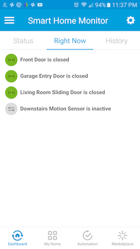

## SmartThings Connected Wired Security System using a NodeMCU ESP8266

This project will help you connect SmartThings to wired contact sensors (for doors and windows) and motion sensors that you may already have pre-wired in your home from a built-in home security system. There are three components to the project:

1. a SmartThings Device Hander for contact sensors and motion sensors
2. a SmartThings SmartApp that receives HTTP POST messages
3. Lua code for the NodeMCU device that connects your wired system to the cloud

### Background

The house I live in was built in the early 90s and came with a built-in home security system. I'm not interested in using the outdated alarm system panel, but I wanted to connect the contact sensors in my doors and the motion sensor in my house to SmartThings. I learned about the NodeMCU ESP8266, a small, cheap, programmable development board that has WiFi built in. I set out to connect my door and motion sensors to the NodeMCU and program it to update SmartThings every time a change is detected.

This was my first time using any sort of development board, and I have zero electrical engineering experience. I am, however, a software developer by profession, and Lua programming looked familar to me, so I was hopeful I could make it work. A few evenings of work later, and it works great!

### Some photos

| a | b | c |
| --- | --- | --- |
|  |  |  |
|  I opened up the alarm panel and rerouted the wires for the sensors to the NodeMCU resting on top | Closeup of the NodeMcu | Devices in SmartThings |
