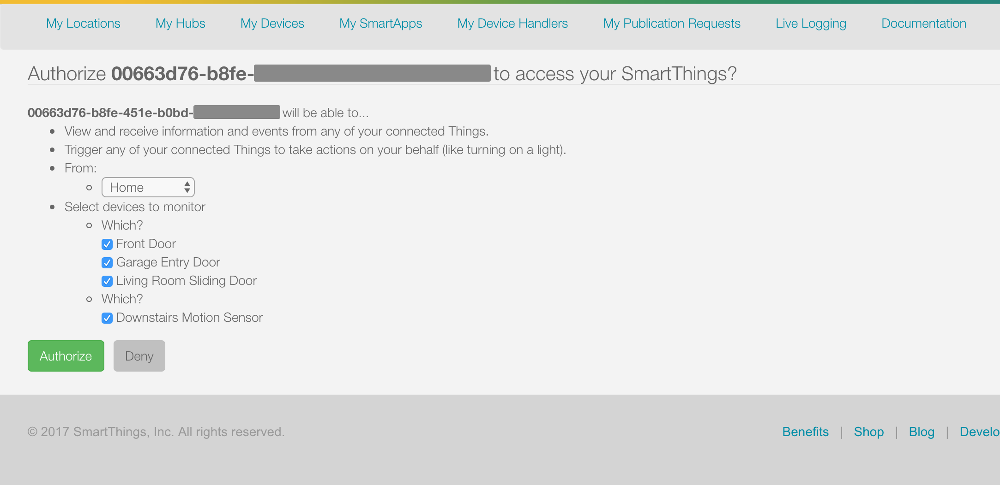
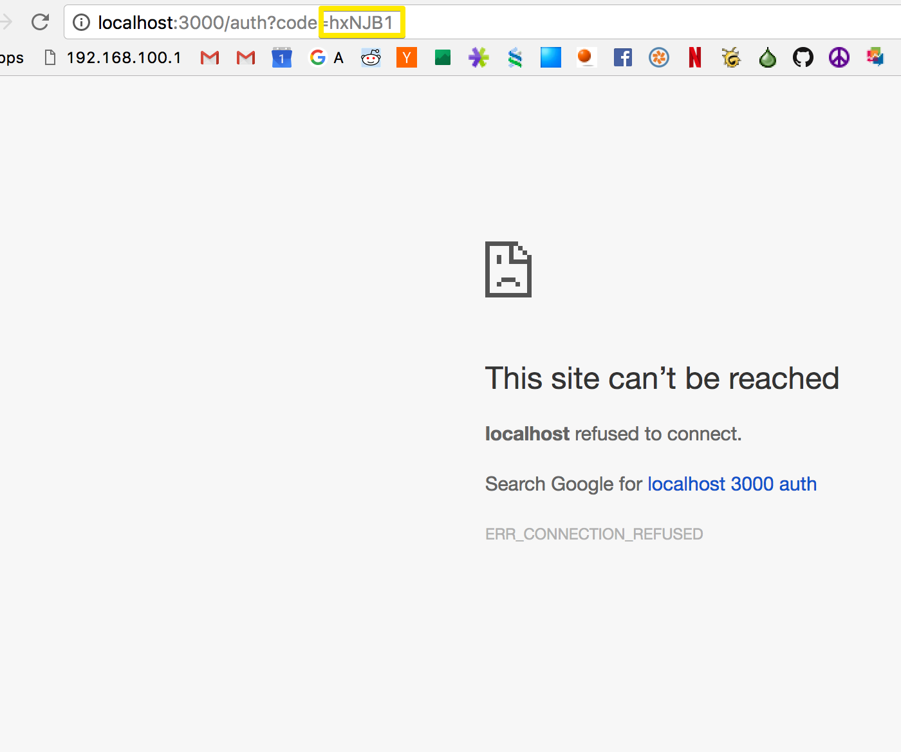
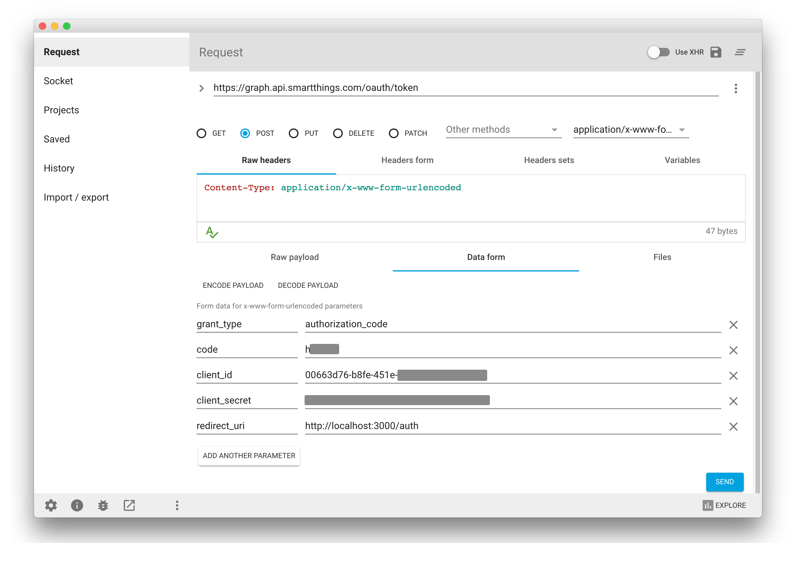
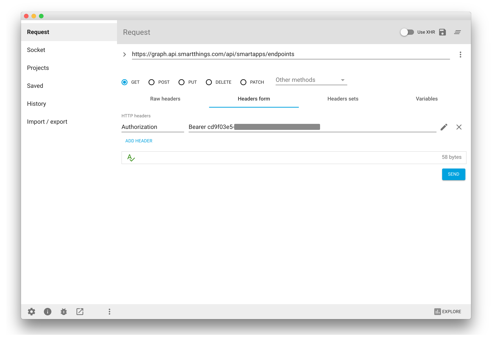

# SmartThings Connected Wired Security System using a NodeMCU ESP8266

This project will help you connect SmartThings to wired contact sensors (for doors and windows) and motion sensors that you may already have pre-wired in your home from a built-in home security system. There are three components to the project:

1. a SmartThings Device Hander for contact sensors and motion sensors
2. a SmartThings SmartApp that receives HTTP POST messages
3. Lua code for the NodeMCU device that connects your wired system to the cloud

### Background

The house I live in was built in the early 90s and came with a built-in home security system. I'm not interested in using the outdated alarm system panel, but I wanted to connect the contact sensors in my doors and the motion sensor in my house to SmartThings. I learned about the NodeMCU ESP8266, a small, cheap, programmable development board that has WiFi built in. I set out to connect my door and motion sensors to the NodeMCU and program it to update SmartThings every time a change is detected.

### Materials

1. A NodeMCU development board. [This is the one I bought on Amazon](https://www.amazon.com/gp/product/B010O1G1ES/ref=as_li_tl?ie=UTF8&camp=1789&creative=9325&creativeASIN=B010O1G1ES&linkCode=as2&tag=heythisisnate-20&linkId=2234c680df64af67b74eb313b8ca82df) for about $8. 
1. A [basic breadboard](https://www.amazon.com/gp/product/B004RXKWDQ/ref=as_li_tl?ie=UTF8&tag=heythisisnate-20&camp=1789&creative=9325&linkCode=as2&creativeASIN=B004RXKWDQ&linkId=3b866cc598e537821e1e021c95eb2601).
1. Some [extra wires of various male/female combinations](https://www.amazon.com/gp/product/B01FSGGJLY/ref=as_li_tl?ie=UTF8&tag=heythisisnate-20&camp=1789&creative=9325&linkCode=as2&creativeASIN=B01FSGGJLY&linkId=c23cd9573b73d437a52781fee10722e6).
1. A micro USB cable and power adapter

_Update:_ Later on I saw [this NodeMCU board with a base and wires](https://www.amazon.com/gp/product/B016W46I9E/ref=as_li_tl?ie=UTF8&tag=heythisisnate-20&camp=1789&creative=9325&linkCode=as2&creativeASIN=B016W46I9E&linkId=2f2844286a96021450f0da09cd3513f0) that looks like a great all in one starter package that I probably would buy if I were doing it again.

### Some photos

| a | b | c |
| --- | --- | --- |
|  |  |  |
|  I opened up the alarm panel and rerouted the wires for the sensors to the NodeMCU resting on top | Closeup of the NodeMcu | Devices in SmartThings |

## Step by Step Setup Guide

### 1. Create Device Handler(s) in SmartThings

1. Log in to the [SmartThings IDE](https://graph.api.smartthings.com) -> My Locations -> click on your location
1. Go to My Device Handlers -> Create New Device Handler
1. Click the _From Code_ tab and paste the content of one of the device handlers and save:
  * [NodeMCU Connected Contact Sensor](https://raw.githubusercontent.com/heythisisnate/SmartThingsPublic/master/devicetypes/heythisisnate/nodemcu-connected-contact-sensor.src/nodemcu-connected-contact-sensor.groovy)
  * [NodeMCU Connected Motion Sensor](https://raw.githubusercontent.com/heythisisnate/SmartThingsPublic/master/devicetypes/heythisisnate/nodemcu-connected-motion-sensor.src/nodemcu-connected-motion-sensor.groovy)
1. Click Publish -> For Me
1. Repeat for the other device handler if you need both types


### 2. Create Devices in SmartThings

You'll need to create a device for each sensor that you plan on connecting. Repeat these steps for each sensor:

1. In the SmartThings IDE, go to My Devices
1. Click New Device and fill out the form giving your device a name like "Front Door"
1. In the Device Type dropdown, select either the _NodeMCU Connected Contact Sensor_ or _NodeMCU Connected Motion Sensor_ that you created earlier.
1. The Device Network Id doesn't seem to really matter, I just put a number.
1. Once you've created the device, make note of the device's URL. It will be something like `https://graph-na02-useast1.api.smartthings.com/device/show/22433333-1111-41dc-0000-00000000000`. The last part of the url is the Device Id, and you'll need this later when we program the NodeMCU.

### 3. Create the SmartApp

The SmartApp receives data from your NodeMCU device, and updates the status of your devices in SmartThings.

1. Go to My SmartApps -> New SmartApp
1. Click the _From Code_ tab and paste the content of the SmartApp:
  * [Cloud Sensor](https://raw.githubusercontent.com/heythisisnate/SmartThingsPublic/master/smartapps/heythisisnate/cloud-sensor.src/cloud-sensor.groovy)
1. Once the SmartApp is created, click the edit icon or go to App Settings -> OAuth and enable OAuth and save.
1. Make note of the OAuth Client ID and Client Secret, you'll need these later.
1. Click Publish -> For Me

### 4. Generate an OAuth token

The OAuth token is used to sign HTTP requests from the NodeMCU to the SmartApp you just created. [SmartThings has documentation of this process here.](http://docs.smartthings.com/en/latest/smartapp-web-services-developers-guide/authorization.html). We'll be going through the OAuth flow manually to capture the token which can then be saved on the NodeMCU.

1. Copy and paste the below web address into your browser and replace `YOUR-SMARTAPP-CLIENT-ID` with the OAuth Client ID from the SmartApp created eariler.
   
   ```
   https://graph.api.smartthings.com/oauth/authorize?response_type=code&client_id=YOUR-SMARTAPP-CLIENT-ID&scope=app&redirect_uri=http://localhost:3000/auth
   ```
   
1. You'll see a page like this allowing you to authorize the devices you set up earlier:

   

1. Once you click Authorize, you'll be redirect to http://localhost:3000/auth which will error. That's ok! It wasn't supposed to work. All you need is the code out of the URL parameter:

   

1. Now that you've got the code, it's time to make a POST request to get the access token. For this I like to use tools [Advanced REST Client Chrome app](https://chrome.google.com/webstore/detail/advanced-rest-client/hgmloofddffdnphfgcellkdfbfbjeloo?hl=en-US). You can use any tool that can create a POST request with form parameters. Just fill in [the fields](http://docs.smartthings.com/en/latest/smartapp-web-services-developers-guide/authorization.html#get-access-token) as shown:

  

1. Click Send, and with any luck, you'll get a successful response back that contains your access token:

  

1. Finally, get your SmartApp endpoint by doing a GET request to `https://graph.api.smartthings.com/api/smartapps/endpoints`, signing the request with an `Authorization` header and your token:
  
    

1. Click send and make note of the url data returned:
  
    


### 5. Configure Your Devices

1. Clone or download this repository and open up the `lua` folder.
1. Copy or rename `variables.lua.example` to `variables.lua`
1. Copy or rename `credentials.lua.example` to `credentials.lua`
1. Open up `credentials.lua` in your favorite text editor and put in your WiFi SSID and password, and the access token obtained in the previous step. 